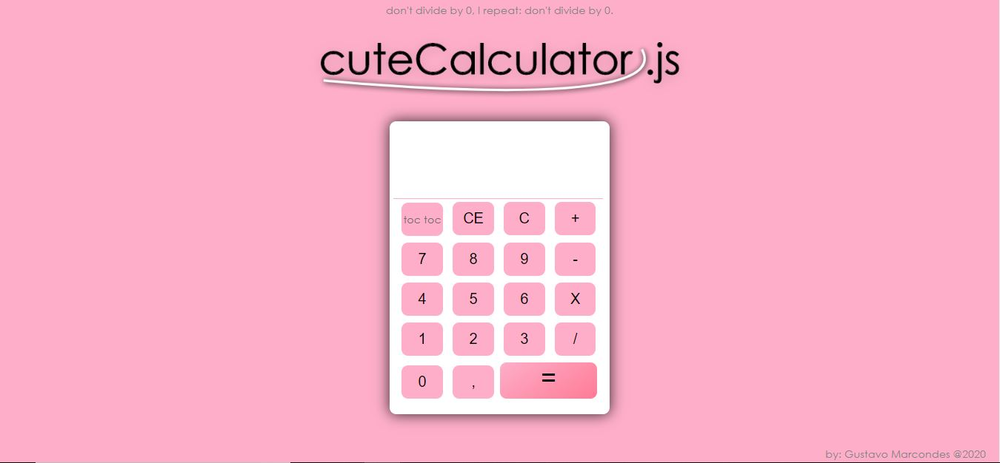

# CuteCalculatorjs

### Calculadora desenvolvida em Javascript sem utilizar o método eval() para converter as expressões

>### Para navegar nela clique [aqui](https://akhena1.github.io/Cute-Calculator-JS/)

> e eu levaria a sério os avisos se fosse você
